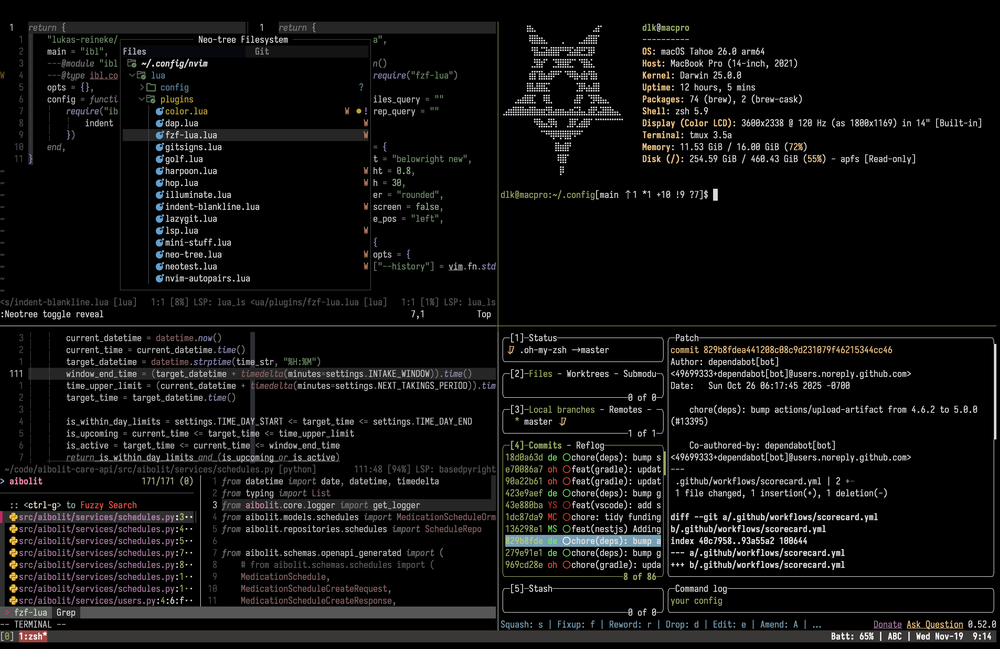
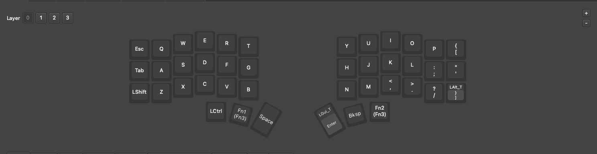

# 507015t(soloist) dotfiles🎃
## Contents
- Vim (Neovim) config
- [Alacritty](https://alacritty.org/) config
	Font [**Menlo Nerd**](https://github.com/507015T/menlo-nerd-font.git)
- [Tmux](https://github.com/tmux/tmux) config
- Zsh config
- Corne choc (42 keys) config
- [lf](https://github.com/gokcehan/lf) config
- [Fastfetch](https://github.com/fastfetch-cli/fastfetch) config 
## Clean Setup (MacOS)
```bash
cd && git clone https://github.com/507015T/dopefiles.git && ~/dopefiles/install.sh
```

## Split keyboard ( Corne choc )



