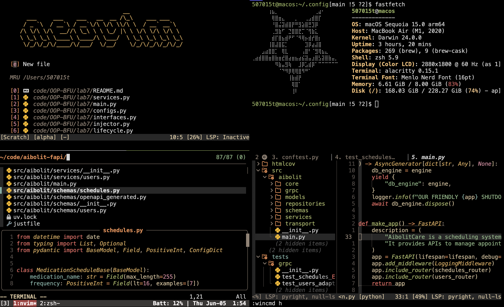

# 507015t(soloist) dotfiles🎃
## Contents
- Vim (Neovim) config
- [Kitty](https://sw.kovidgoyal.net/kitty/)(terminal) config
	Font **PlemolJP Console NF**
- [Tmux](https://github.com/tmux/tmux) config
- Zsh config
- Corne choc (42 keys) config
- [lf](https://github.com/gokcehan/lf) config
- [Yabai](https://github.com/koekeishiya/yabai) & [SKHD](https://github.com/koekeishiya/skhd) config
- [Fastfetch](https://github.com/fastfetch-cli/fastfetch) config 
- [Powerlevel10k](https://github.com/romkatv/powerlevel10k) config
## Clean Setup (MacOS)
```bash
cd && git clone git@github.com:507015T/dopefiles.git && ~/dopefiles/install.sh
```

